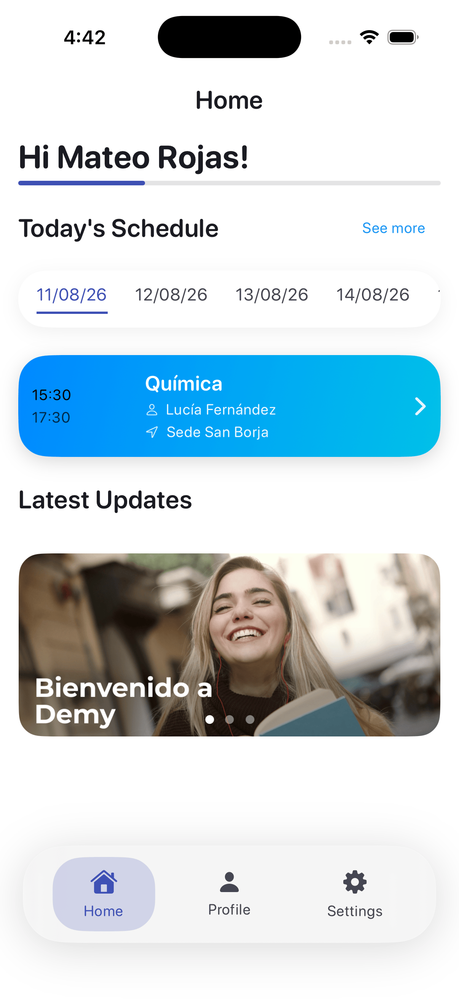
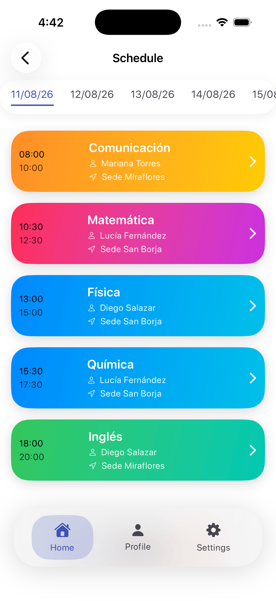
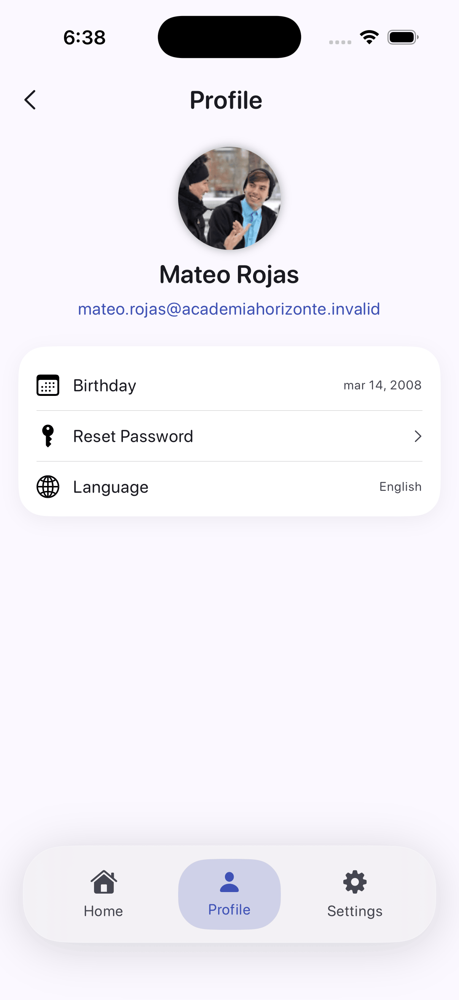
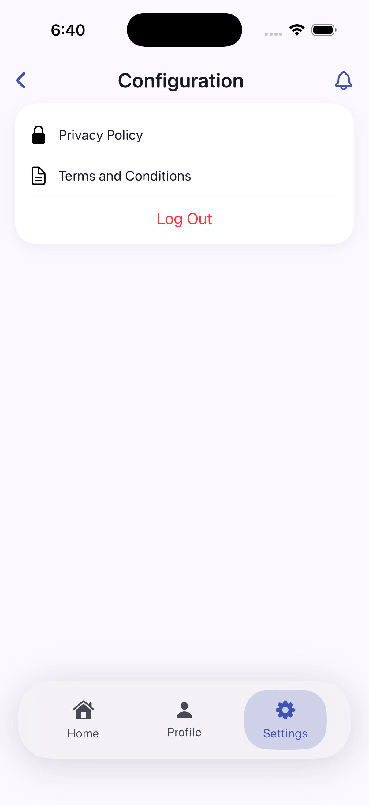

# Demy Students

[English](./README.md) | [Español](./README.es.md)

  

La aplicación nativa para estudiantes que usan **Demy** en iOS. Ofrece una vista clara de la actividad diaria de la academia, próximas clases, información personal y configuración de cuenta mediante una experiencia SwiftUI conectada con Demy API.

## Capacidades para estudiantes

- Inicio de sesión seguro y persistencia de sesión mediante Keychain.
- Inicio personalizado con clases del día y novedades de la academia.
- Horario completo con detalle de sesiones.
- Perfil del estudiante y formato de fecha de nacimiento según el idioma.
- Configuración de contraseña, idioma, privacidad, términos y sesión.
- Localización en inglés y español latinoamericano en Inicio, Perfil y Configuración.

## Vista previa del producto

<table>
  <tr>
    <td></td>
    <td></td>
  </tr>
  <tr>
    <td></td>
    <td></td>
  </tr>
</table>

## Tecnología y arquitectura

- Swift y SwiftUI con un sistema de diseño propio.
- MVVM y Clean Architecture organizados por funcionalidad.
- Red asíncrona con URLSession y async/await.
- Repositorios y casos de uso con inyección de dependencias.
- Sesión persistida en Keychain.
- Localización mediante String Catalogs (`en` y `es-419`).

```text
DemyStudents/
├── App/            # Ciclo de vida, configuración, navegación, DI y sesión
├── Core/           # Red, almacenamiento y utilidades compartidas
├── Features/       # Auth, Inicio, Horarios, Perfil y Configuración
├── Resources/      # String Catalogs localizados
└── Shared/         # Sistema de diseño y UI reutilizable
```

## Ejecución local

### Requisitos

- macOS con Xcode
- Simulador o dispositivo con iOS 17+
- Demy API accesible desde el destino seleccionado

```bash
open DemyStudents.xcodeproj
```

La URL base de la API se define en `DemyStudents/App/Config/Environment.swift`. Las dependencias de Swift Package se resuelven al abrir el proyecto.

## Verificación por línea de comandos

```bash
xcodebuild \
  -project DemyStudents.xcodeproj \
  -scheme DemyStudents \
  -configuration Debug \
  -sdk iphonesimulator \
  -destination 'platform=iOS Simulator,name=iPhone 17 Pro' \
  CODE_SIGNING_ALLOWED=NO build
```

## Ecosistema Demy

- [Landing page](https://github.com/nistrahq/demy-landing)
- [Backend API](https://github.com/nistrahq/demy-api)
- [Aplicación de administradores](https://github.com/nistrahq/demy-admins)
- [Aplicación de docentes](https://github.com/nistrahq/demy-teachers)

Consulta [CONTRIBUTING.es.md](./CONTRIBUTING.es.md) para conocer las convenciones de contribución y Git.
